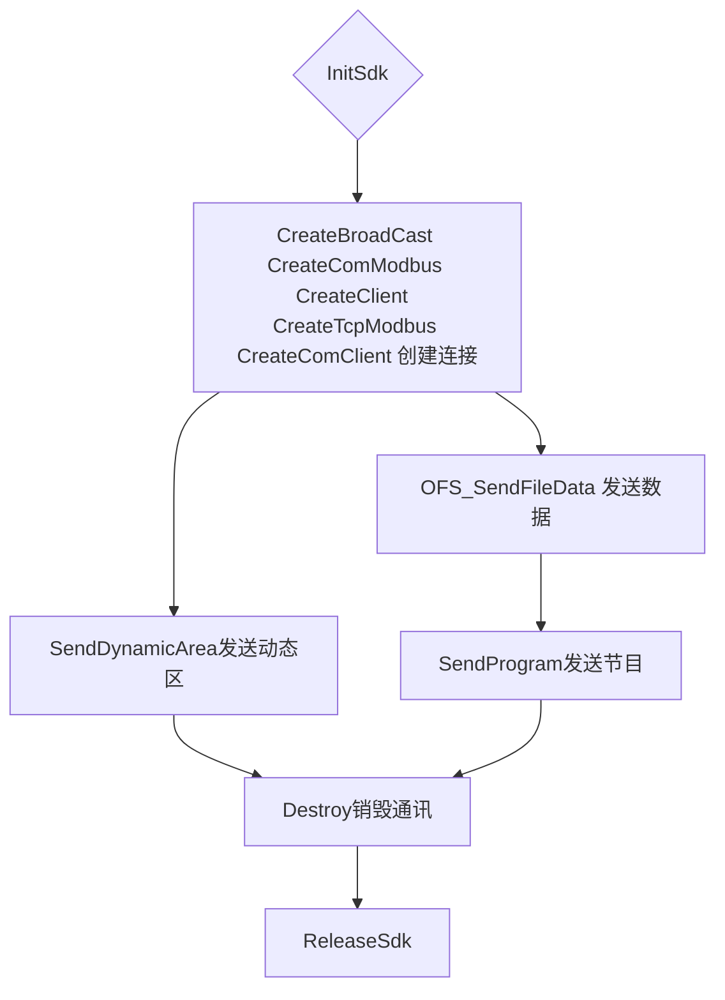

# Led5kSDK使用说明
## 1 快速开发导读
字库卡（BX-5K1/5K2、BX-5MK1/5MK2、BX-5K1Q-YY、BX-6K1/K2/K3）支持动态链接库开发和协议开发，本文档主要针对动态链接库开发的相关说明，需要协议开发请参照我们提供的协议文档。
如果你想尽快开发出一个能简单控制的软件，建议按以下流程阅读本文档，并进行软件开发。
- 阅读错误码及说明
- 阅读API调用顺序
- 阅读函数说明
## 2 错误码及说明
动态库中每个接口函数最后都返回函数执行结果，用户可根据函数执行结果查找判断该函数的执行情况。
### *2.1错误状态*

错误名称  | 代码 | 说明
---|--- |---
ERR_NO | 0 | 没有错误
ERR_OUTOFGROUP | 1 | Command Group Error
ERR_NOCMD | 2 | Command Not Found
ERR_BUSY | 3 | The Contorller is busy now
ERR_MEMORYVOLUME | 4 | Out of the Memory Volume
ERR_CCHECKSUM | 5 | CRC16 Checksum Error
ERR_FILENOTEXIST | 6 | File Not Exist
ERR_FLASH | 7 | Flash Access Error
ERR_FILE_DOWNLOAD | 8 | File Download Error
ERR_FILE_NAME | 9 | File Name Error
ERR_FILE_TYPE | 10 | File Type Error
ERR_FILE_CRC16 | 11 | File CRC16 Error
ERR_FONT_NOT_EXIST | 12 | Font Library Not Exist
ERR_FIRMWARE_TYPE | 13 | Firmware Type Error (Check the controller type)
ERR_DATE_TIME_FORMAT | 14 | Date Time format error
ERR_FILE_EXIST | 15 | File Exist for File overwrite
ERR_FILE_BLOCK_NUM | 16 | File block number error
ERR_COMMUNICATE | 100 | 通信失败
ERR_PROTOCOL  | 101 | 协议数据不正确
ERR_TIMEOUT | 102 | 通信超时
ERR_NETCLOSE | 103 | 通讯断开
ERR_INVALID_HAND | 104 | 无效句柄
ERR_PARAMETER | 105 | 参数错误
ERR_SHOULDREPEAT | 106 | 需要重复上次的错误包
ERR_FILE | 107 | 无效文件
## 3 显示屏初始化说明
控制器接入动态库使用的系统前需要首先使用我司提供的 LedshowZK2017软件来进行控制卡
地址、通讯波特率、网络 IP(如有网口)、端口地址(如有网口)、扫描方式等设置；设置好后就可以再接入本动态库的系统中按照之前设定好的相关参数来设定显示屏的其它参数、信息和命令了。
## 4 API调用顺序
### *4.1总体次序*
在执行其他操作之前，首先执行函数InitSDK初始化动态库，然后选择通讯模式， 设置不同模式
下的参数，连接控制器(广播模式执行函数CreateBroadCast，网络固定ip模式执行函数CreateClient，
网络modbus模式执行函数CreateTcpModbus， 485总线模式执行函数CreateComClient， 串口modbus模式执行函数CreateComModbus)，设置网络超时时间执行函数SetTimeout。 之后可以执行图文区节目（发送节目OFS_SendFileData、删除节目OFS_DeleteFile、锁定/解锁节目SCREEN_LockProgram）、动态区节目（发送节目SCREEN_SendDynamicArea、删除节目SCREEN_DelDynamicArea）、开关（强制开关机SCREEN_ForceOnOff，定时开关机SCREEN_TimeTurnOnOff，取消定时开关机SCREEN_CancelTimeOnOff）、固件查询（查询固件信CON_CheckCurrentFirmware，激活固件CON_FirmwareActivate）、控制器状态查询（CON_ControllerStatus）、 （亮度调整SCREEN_SetBrightness，复位CON_Reset， ping CON_PING， 校时CON_SytemClockCorrect） 等操作。例如RS485模式中函数的调用：



## 5 函数说明
### *5.1 InitSdk函数* 
- 函数

```
public static extern void InitSdk(byte minorVer,byte majorVer);
```
- 参数

参数 | 描述
--- | ---
minorVer | 固定值为2，不能改变，无意义
majorVer | 固定值为2，不能改变，无意义
- 说明

初始化动态库
### *5.2 ReleaseSdk函数*
- 函数
```
public static extern void ReleaseSdk();
```
- 参数

无
- 说明

释放动态库
### *5.3 CreateBroadCast函数*
- 函数

```
public static extern uint CreateBroadCast(byte[] broad_ip,uint broad_port,
bx_5k_card_type card_type,int mode);
```
- 参数

参数 | 描述
--- | ---
broad_ip | 广播IP
broad_port | 端口号
card_type | 控制卡类型 枚举类型
mode | 显⽰模式：0普通模式 ； 1动态模式（动态区优先节⽬显⽰）


- 说明

通过广播模式连接控制卡，设置广播IP、端口号、控制卡类型
### *5.4 CreateClient函数* ###
- 函数
```
public static extern uint CreateClient(byte[] led_ip,uint led_port,bx_5k_card_type card_type,int tmout_sec,int mode,CallBackClientClose pCloseFunc);
```
- 参数

参数 | 描述
--- | ---
led_ip | 控制卡IP
led_port | 端口号
card_type | 控制卡型号 枚举类型
tmout_sec | 创建连接超时时间
mode | 显⽰模式：0普通模式 ； 1动态模式（动态区优先节⽬显⽰）
pCloseFunc | 回调函数，参数值为null
- 说明

通过网络固定IP模式连接控制卡，设置控制卡IP、端口号、控制卡类型，回调函数：
```
[System.Runtime.InteropServices.UnmanagedFunctionPointerAttribute(System.Runtime.InteropServices.CallingConvention.StdCall)]
public delegate void CallBackClientClose(uint hand, int err);
```
### *5.5 CreateTcpModbus函数* ###
- 函数

```
public static extern uint CreateTcpModbus(byte[]led_ip,bx_5k_card_type card_type,CallBackClientClose pCloseFunc);
```
- 参数

参数 |  描述
--- | ---
led_ip | 控制卡IP
card_type | 控制卡型号 枚举类型
pCloseFunc | 回调函数，参数值为null
- 说明[不支持使用]

通过网络 modbus 模式连接控制卡，设置控制卡 IP， 选择控制卡， 回调函数：
```
[System.Runtime.InteropServices.UnmanagedFunctionPointerAttribute(System.Runtime.InteropServices.CallingConvention.StdCall)]
public delegate void CallBackClientClose(uint hand, int err); 
```
### *5.6 CreateComClient函数* ###
- 函数

```
public static extern uint CreateComClient (byte com,uint baudrate,bx_5k_card_type card_type card_type,int mode,ushort ScreenID);
```
- 参数

参数 | 描述
--- | ---
com | 串口号
baudrate |波特率
card_type | 控制卡型号 枚举类型
mode | 显⽰模式：0普通模式 ； 1动态模式（动态区优先节⽬显⽰）
ScreenID | 屏号
- 说明

通过串口连接控制卡，设置控制卡串口号、波特率、控制卡型号和屏号。
### *5.7 CreateComModbus函数* ###
- 函数

```
public static extern uint CreateComModbus(byte com,uint baudrate,serial_parity Parity,serial_databits DataBits ,serial_stopbits StopBits,bx_5k_card_type card_type,ushort ScreenID);
```
- 参数

参数 | 描述
--- | ---
com | 串口号
baudrate | 波特率
Parity | 串口校验模式 枚举类型 serial_parity
DataBits | 串口数据位 枚举类型serial_databits
StopBits | 串口停止位 枚举类型serial_stopsbits
card_type | 控制卡型号 枚举类型
ScreenID | 屏号
- 说明【不支持使用】

通过串口Modbus模式连接控制卡，设置控制卡串口号、波特率、校验模式、串口数据位、串口停止位、控制卡型号、屏号。
### *5.8 Destroy函数* ###
- 函数

```
public static extern void Destroy(uint dwHand);
```
- 参数

参数 | 描述
--- | ---
dwHand | 连接控制卡函数的返回值
- 说明

销毁通讯
### *5.9 SetTimeOut函数* 
- 函数

```
public static extern void SetTimeOut(uint dwHand,uint nSec);
```
- 参数

参数 | 描述
--- | ---
dwHand | 连接控制卡函数的返回值
nSec | 设计超时时间，单位为s
- 说明

连接控制卡后，通过调用该函数设置通讯超时时间
### *5.10 CON_PING函数*
- 函数

```
public static extern int CON_PING(uint dwHand);
```
- 参数

参数 | 描述
--- | ---
dwHand | 连接控制卡函数的返回值
- 返回值

详见错误码及说明
- 说明

若ping命令执行成功，说明与控制卡通信成功
### *5.11 CON_ReSet函数*
- 函数

```
public static extern int CON_ReSet(uint dwHand);
```
- 参数

参数 | 描述
--- | ---
dwHand | 连接控制卡函数的返回值
- 返回值

详见错误码及说明
- 说明

复位，控制器连接接收到系统复位命令后，擦除FirmWare文件外的所有数据文件，然后复位CPU。
### *5.12 CON_ControllerStatus函数*
- 函数

```
public static extern int CON_ControllerStatus(uint dwHand,byte[] pStatus,ref ushort len);
```
- 参数

参数 | 描述
--- | ---
dwHand | 连接控制卡函数的返回值
pStatus | 具体见代码 控制器查询状态
len | 设置默认为0
- 返回值

详见错误码及说明
- 说明

查询控制器当前的图文节目(个数和节目名)、动态节目(列表和个数)、开机状态、亮度值、以
及控制卡时间。
### *5.13 CON_CheckCurrentFont函数*
- 函数

```
public static extern int CON_CurrentCustomer(uint dwHand,byte [] fontStatus,ref ushort len);
```
- 参数

参数 | 描述
--- | ---
dwHand | 连接控制卡函数的返回值
fontStatus | 字库状态
len | 设置默认为0

- 返回值

详见错误码及说明
- 说明

查询字库信息
### *5.14 CON_CheckCurrentCustomer*
- 函数

```
public static extern int CON_CheckCurrentCustomer(uint dwHand,byte[] CustomerStatus,ref ushort len);
```
- 参数

参数 | 描述
--- | ---
dwHand | 连接控制卡函数的返回值
CustomerStatus | 回读的客户信息
len | 默认设置为0
- 返回值

详见错误码及说明
- 说明

回读客户信息
### *5.15 CON_ReadScreen函数*
- 函数
```
public static extern int CON_ReadScreen(uint dwHand,byte[] ScreenStatus,ref ushort len);
```
- 参数

参数 | 描述
--- | ---
dwHand | 连接控制卡函数的返回值
ScreenStatus | 屏幕状态
len | 设置默认为0
- 返回值

详见错误码及说明

- 说明

参数回读
### *5.16 CON_SystemClockCorrect函数*
- 函数

```
public static extern int CON_SystemClockCorrect(uint dwHand);
```
- 参数

参数 | 描述
--- | ---
dwHand | 连接控制卡函数的返回值
- 返回值

详见错误码及说明

- 说明

校正系统时间

### *5.17 CON_CheckCurrentFirmware*
- 函数

```
public static extern int CON_CheckCurrentFirmware(uint dwHand,byte [] FirmwareVersion,byte[] FirmwareDateTime);
```
- 参数

参数 | 描述
--- | ---
dwHand | 连接控制卡函数的返回值
FirmwareVersion | 固件版本号
FirmwareDateTime | 固件时间

- 返回值

详见错误码及说明
- 说明

查询固件版本号

### *5.18 CON_FirmwareActivate函数*
- 函数

```
public static extern int CON_FirmwareActivate(uint dwHand,byte [] FirmwareName);
```
- 参数

参数 | 描述
--- | ---
dwHand | 连接控制卡函数的返回值
FirmwareName | 固件名

- 返回值

详见错误码及说明
- 说明

激活固件
### *5.19 CON_SetScreenID函数*
- 函数

```
public static extern int CON_SetScreenID(uint dwHand, ushort newScreenID);
```
- 参数

参数 | 描述
--- | ---
dwHand | 连接控制卡函数的返回值
newScreenID | 屏号
- 返回值

详见错误码及说明
- 说明

设置控制卡屏号

### *5.20 CON_ReadScreenID函数*
- 函数

```
public static extern int CON_ReadScreenID(uint dwHand,ref ushort pScreenID);
```
- 参数

参数 | 描述
--- | ---
dwHand | 连接控制卡函数的返回值
pScreenID | 回读的屏号
- 返回值

详见错误码及说明
- 说明

读取控制卡屏号
### *5.21 SCREEN_ForceOnOff函数*
- 函数

```
public static extern int SCREEN_ForceOnOff(uint dwHand,byte OnOffFlag);
```
- 参数

参数 | 描述
--- | ---
dwHand | 连接控制卡函数的返回值
OnOffFlag | 开关标志1标示开2标示关
- 返回值

详见错误码及说明
- 说明

强制开关机
### *5.22 SCREEN_TimeTurnOnOff函数*
- 函数

```
public static extern int SCREEN_TimeTurnOnOff(uint dwHand,byte[] pTimer,int nGroup);
```
- 参数

参数 | 描述
--- | ---
dwHan | 连接控制卡函数的返回值
pTimer | 定时器定时开机时间，BCD码标示，格式如下：时（1）+分（1）定时关机时间，BCD码表示，格式如下：时（1）+分（1）
nGroup | 分组编号

- 返回值

详见错误码及说明

- 说明

设置定时开关机
### *5.23 SCREEN_SetBrigthness函数*
- 函数

```
public static extern int SCREEN_SetBrightness(uint dwHand,byte BrigthnessType,byte CurrentBrigthness,byte [] BrigthnessValue);
```
- 参数

参数 | 描述
--- | ---
dwHand | 连接控制卡函数的返回值
BrigthnessType | 亮度调整方式 0x01—强制调节亮度 0x02—定时调节亮度
CurrentBrigthness | 当前亮度，强制调节亮度时有效，亮度值为0-15共16级。亮度值为15时亮度最高
BrigthnessValue | 亮度值列表，用于定时调亮把一天分为48个时段，每30分钟为一个时段，此处48个字节为每个时段的亮度值
- 返回值

详见错误码及说明
- 说明

调整屏幕亮度值
### *5.24 SCREEN_SetWaitTime函数*
- 函数

```
public static extern int SCREEN_SetWaitTime(uint dwHand,byte WaitTime);
```
- 参数

参数 | 描述
--- | ---
dwHand | 连接控制器函数的返回值
WaitTime | 等待时间

- 返回值

详见错误码及说明

- 说明

设置等待时间
### *5.25 SCREEN_LockProgram函数*
- 函数

```
public static extern int SCREEN_LockProgram(uint dwHand,byte LockFlag,byte StoreMode,byte[] ProgramFileName);
```
- 参数

参数 | 描述
--- | ---
dwHand | 连接控制卡函数的返回值
LockFlag | 当前图文节目锁定为1，解锁为0
StoreMode | 默认为0
ProgramFileName | 当前显示的图文节目名

- 返回值

详见错误码及说明
- 说明

该函数是锁定或解锁当前图文节目，若为是锁定节目则函数参数 LockFlag=1；解锁 LockFlag=0
### *5.26 SCREEN_DelDynamicArea函数*
- 函数

```
public static extern int DelDynamicArea(uint dwHand,byte DeleteAreaId);
```
- 参数

参数 | 描述
--- | ---
dwHand | 连接控制卡函数的返回值
DeleteAreaId | 要删除的动态区编号
- 返回值

详见错误码及说明

- 说明

删除动态区
### *5.27  SCREEN_SendDynamicArea函数*
- 函数

```
public static extern int SCREEN_SendDynamicArea(uint dwHand,bx_5k_area_header header,ushort TextLen,byte[] AreaText);
```
- 参数

参数 | 描述
--- | ---
dwHand | 连接控制卡函数的返回值
header | 结构体类型bx_5k_area_header,动态区数据参数，参数设置见区域数据格式设置
TextLen | 动态区数据长度
AreaText | 动态区数据
- 返回值

详见错误码及说明

- 说明

发送动态区，该函数向指定的动态区域发送动态区节目，参考“区域数据格式设置”设置相应的参数，添加节目内容，计算内容长度。节目断电后不会保存。
### *5.28  SCREEN_SendSoundDynamic函数*
- 函数

```
public static extern int SCREEN_SendSoundDynamic(uint dwHand, bx_5k_area_header header, ushort TextLen, byte[] AreaText, byte SoundMode, byte SoundPerson, byte SoundVolume, byte SoundSpeed, int sound_len, byte[] sounddata);
```
- 参数

参数 | 描述
--- | ---
dwHand | 连接控制卡函数的返回值
header | 结构体类型bx_5k_area_header,动态区数据参数，参数设置见区域数据格式设置
TextLen  | 动态区数据长度
AreaText | 动态区数据
SoundMode | 声音类型
SoundPerson | 发音人
SoundVolume | 音量
SoundSpeed | 音速
sound_len | 声音数据长度
sounddata | 声音数据
- 返回值

详见错误码及说明

- 说明


发送语音动态区

### *5.29 SCREEN_CancelTimeOnOff函数*
- 函数

```
public static extern int SCREEN_CancelTimeOnOff(uint dwHand);
```
- 参数

参数 | 描述
--- | ---
dwHand | 连接控制卡函数的返回值

- 返回值

详见错误码及说明

- 说明

取消定时开关机
### *5.30 BX5MK_SetSpecialAppDynamic函数*
- 函数

```
public static extern int BX5MK_SetSpecialAppDynamic(uint dwHand, ushort AreaX, ushort AreaY, ushort AreaW, ushort AreaH,byte DataType, byte Pagetotal, byte RunState, ushort Timeout, byte SingleLine, byte Lines_sizes, byte NewLine, ushort StayTime);
```
- 参数

参数 | 描述
--- | ---
dwHand | 连接控制卡函数的返回值
AreaX | 区域的X坐标
AreaY | 区域的Y坐标
AreaW | 区域宽度
AreaH | 区域高度
DataType | 数据类型 0— 编码格式 1— 点阵格式
Pagetotal | 区域数据总页数 注意，数据类型为点阵格式时总页数强制为 0
RunState | 动态区运行模式 0— 动态区数据循环显示。 1— 动态区数据显示完成后静止显示最后一页数 据。 2— 动态区数据循环显示，超过设定时间后数据仍 未更新时删除动态区信息
TimeOut | 动态区数据超时时间，单位为秒 
SingleLine | 是否单行显示 0x01——单行显示 0x02——多行显示 注意，点阵格式下该参数无效，默认为 0
Lines_size | 行间距 注意，点阵格式下该参数无效，默认为 0
NewLine | 是否自动换行 0x01——不自动换行，显示数据在换行时必须插入 换行符 0x02——自动换行，显示内容不需要换行符，但是 只能使用统一的中文字体和英文字体 注意，点阵格式下该参数无效，默认为 0
StayTime |显示停留时间，单位为 0.5s 注意，点阵格式下该参数无效，默认为 0。 
- 返回值

详见错误码及说明
- 说明 
设置特殊动态区（点阵）

### *5.31 BX5MK_SendPageData函数*
- 函数

```
public static extern int BX5MK_SendPageData(uint dwHand, byte PageNum, ushort PageDataLen, byte[] PageData);
```
- 参数

参数 | 描述
--- | ---
dwHand | 连接控制卡函数的返回值
PageNum | 页号，页号从 0 开始递增，不能大于总页数
PageDataLen | 页数据长度
PageData | 页数据
- 返回值

详见错误码及说明

- 说明
发送分页数据
### *5.32 BX5MK_SendLatticeMessage函数*
- 函数

```
public static extern int BX5MK_SendLatticeMessage(uint dwHand,byte BlockFlag,ushort BlockAddr,byte[] BlockData,ushort BlockDataLen);
```
- 参数

参数 | 描述
--- | ---
dwHand | 连接控制卡函数的返回值
BlockFlag | 是否最后一包 0— 不是最后一包 1— 最后一包
BlockAddr | 包地址，即把点阵信息分成若干包后每包的基址
BlockData | 包数据，点阵信息分割而得
BlockDataLen | 数据长度
- 返回值

详见错误码及说明

- 说明
发送点阵信息

### *5.33 BX5MK_DelSpecialAppDynamic函数*
- 函数

```
public static extern int BX5MK_DelSpecialAppDynamic(uint dwHand);
```
- 参数

参数 | 描述
--- | ---
dwHand | 连接控制卡函数的返回值

- 返回值

详见错误码及说明

- 说明

删除特殊动态区

### *5.34 BX5MK_SetIPAddress函数*
- 函数

```
public static extern int BX5MK_SetIPAddress(uint dwHand, byte ConnnectMode, byte[] ip, byte[] SubnetMask, byte[] Gateway, ushort port,byte ServerMode, byte[] ServerIPAddress, ushort ServerPort, byte[] ServerAccessPassword, ushort HeartBeatInterval, byte[] NetID);
```
- 参数

参数 | 描述
--- | ---
dwHand | 连接控制卡函数的返回值
ConnectMode | 连接方式
ip | ip地址
SubnetMask | 子网掩码 
Getway | 默认网关 
port | 端口号 
ServerMode | 服务器模式是否使能，  1 – 使能，0 – 禁止 
ServerIPAddress | 服务器 IP 地址 
ServerPort | 服务器 端口号 
ServerAccessPassword | 服务器访问密码 
HeartBeatInterval | 心跳时间间隔（单位：秒） 
NetID | 控制器网络 ID 
- 返回值


- 说明
设置IP地址
### *5.35 BX5MK_SetMACAddress函数*
- 函数

```
public static extern int BX5MK_SetMACAddress(uint dwHand,byte[] MAC);
```
- 参数

参数 | 描述
--- | ---
dwHand | 连接控制卡函数的返回值
MAC | MAC地址
- 返回值

详见错误码及说明

- 说明
设置MAC地址

### *5.36 OFS_Formatting函数*
- 函数

```
public static extern int OFS_Formatting(uint dwHand);
```
- 参数

参数 | 描述
--- | ---
dwHand | 连接控制卡函数的返回值

- 返回值

详见错误码及说明

- 说明

该函数格式化控制卡数据，一般不要轻易格式化。

### *5.37 OFS_DeleteFile函数*
- 函数

```
public static extern int OFS_DeleteFile(uint dwHand,ushort FileNumber,byte[] pFileNameList);
```
- 参数

参数 | 描述
--- | ---
dwHand | 连接控制卡函数的返回值
FileNumber | 删除当前图文节目个数为1，删除所有节目该参数值为0
pFileNameList | 删除当前图文节目的节目名，删除所有节目该参数值为null

- 返回值

详见错误码及说明

- 说明

该函数用来删除图文区节目，若删除当前显示的节目，函数的参数FileName=1，pFileNameList的值为要删除的图文节目名，若删除所有节目，则函数的参数FileName=0，pFileNameList=null


### *5.38 OFS_SendFileData函数*
- 函数

```
public static extern int OFS_SendFileData(uint dwHand, byte overwrite, byte[] pFileName, ushort DisplayType, byte PlayTimes,byte[] ProgramLife, byte ProgramWeek, byte ProgramTime, byte[] Period, byte AreaNum, byte[] AreaDataList, int AreaDataListLen);
```
- 参数

参数 | 描述
--- | ---
dwHand | 连接控制卡函数的返回值
overwrite | 设置默认参数为1
pFileName | 文件名 PXXX XXX为文件编号，ASCII码表示文件名为字符串发送按顺序发送，如“P123”，则先发送“P”最后发送“3”
DisplayType | 节目播放方式默认设置为0 --顺序播放
PlayTimes | 节目重复播放次数，默认为1
ProgramLife | 节目生命周期即有效时间范围，默认设置为programLife= newbyte[8]ProgramLif[0]—ProgramLife[7]=0xff表示播放始终有效
ProgramWeek | 节目的星期属性，默认设置为1，表示一周都有效
ProgramTime | 节目定时播放参数，当前为非0，表示非定时
Period | 节目播放时段，当前设置为null表示全天有效
AreaNum | 节目播放个数
AreaDataList | 区域数据参考区域数据格式设置
AreaDataListLen | 区域数据长度

- 返回值

详见错误码及说明

- 说明

通过制定的通讯模式连接到控制卡，向指定的图文区域发送图文节目，该节目断电后会自动保存。
### *5.39 OFS_SendFontData函数*
- 函数

```
public static extern int OFS_SendFontData(uint dwHand, byte overwrite, byte[] pFileName, byte FontWidth, byte FontHeight,byte[] LibData, int LibData_len, byte FontEncode, CloseFunc pCloseFunc);
```
- 参数

参数 | 描述
--- | ---
dwHand | 连接控制卡函数的返回值
overwrite | 默认1
pFileName | 文件名 
FontWidth | 字体宽度 
FontHeigth | 字体高度 
LibData | 标准的字库数据格式 
LibData_len | 数据长度
FontEncode | 字库编码格式。 
pCloseFunc | 回调，详见代码
- 返回值

详见错误码及说明

- 说明


### *5.40 OFS_SendFirmwareData函数*
- 函数

```
public static extern int OFS_SendFirmwareData(uint dwHand,byte overwrite,byte[] pFileName,byte[] pFirmwareData,int FirmwareDataLen,CloseFunc pCloseFunc);
```
- 参数

参数 | 描述
--- | ---
dwHand | 连接控制卡函数的返回值
overwrite | 
pFileName | 文件名
pFirmwareData | 要发送的数据
pFirmwareDataLne | 数据长度
pCloseFunc | 回调，详见代码

- 返回值

详见错误码及说明

- 说明


### *5.41 OFS_SendScreenData函数*
- 函数

```
public static extern int OFS_SendScreenData(uint dwHand,byte overwrite,byte[] pFIleName,ushort Address,byte Baudrate,ushort ScreenWidth,ushort ScreenHeigth,byte color,byte MirrorMode,byte OE,byte DA,byte RowOrder,byte FrePar,byte OEAngle,byte CommTimeout);
```
- 参数

参数 | 描述
--- | ---
dwHand | 连接控制卡函数的返回值
overtime | 
pFileName | 文件名
Address | 地址
Baudrate | 波特率
ScreenWidth | 屏幕宽度
ScreenHeigth | 屏幕高度
color | 颜色值
MirrirMode | 
OE | OE极性
DA | 数据极性
RowOrder | 行序模式
FrePar | 扫描点频
OEAngle | 
CommTimeout | 

- 返回值
 详见错误码及说明
- 说明

### *5.42 OFS_EndSenMultiFiles函数*
- 函数

```
public static extern int OFS_EndSendMultiFiles(uint dwHand);
```
- 参数

参数 | 描述
--- | ---
dwHand | 连接控制卡函数的返回值

- 返回值

详见错误码及说明

- 说明

### *5.43  StartGprsServer函数*
- 函数

```
public static extern int (uint port,CallBack pCallBackCon,ClaaBackLedClose pCallBackClose);
```
- 参数

参数 | 描述
--- | ---
port | 端口
pCallBackCon |回调，详见代码
pCallBackClose | 回调，详见代码
- 返回值

详见错误码及说明
- 说明


### *5.44CloseGprsServer函数*
- 函数

```
public static extern int CloseGprsServer();
```
- 参数

无
- 返回值

详见错误码及说明

- 说明
- 

## 附录

* 错误码

  ```
  
          public class bx5k_err
          {
              public const int ERR_NO = 0; //No Error 
              public const int ERR_OUTOFGROUP = 1; //Command Group Error 
              public const int ERR_NOCMD = 2; //Command Not Found 
              public const int ERR_BUSY = 3; //The Controller is busy now 
              public const int ERR_MEMORYVOLUME = 4; //Out of the Memory Volume 
              public const int ERR_CHECKSUM = 5; //CRC16 Checksum Error 
              public const int ERR_FILENOTEXIST = 6; //File Not Exist 
              public const int ERR_FLASH = 7;//Flash Access Error 
              public const int ERR_FILE_DOWNLOAD = 8; //File Download Error 
              public const int ERR_FILE_NAME = 9; //Filename Error 
              public const int ERR_FILE_TYPE = 10;//File type Error 
              public const int ERR_FILE_CRC16 = 11;//File CRC16 Error 
              public const int ERR_FONT_NOT_EXIST = 12;//Font Library Not Exist 
              public const int ERR_FIRMWARE_TYPE = 13;//Firmware Type Error (Check the controller type) 
              public const int ERR_DATE_TIME_FORMAT = 14;//Date Time format error 
              public const int ERR_FILE_EXIST = 15;//File Exist for File overwrite 
              public const int ERR_FILE_BLOCK_NUM = 16;//File block number error 
              public const int ERR_COMMUNICATE = 100;//通信失败
              public const int ERR_PROTOCOL = 101;//协议数据不正确
              public const int ERR_TIMEOUT = 102;//通信超时
              public const int ERR_NETCLOSE = 103;//通信断开
              public const int ERR_INVALID_HAND = 104;//无效句柄
              public const int ERR_PARAMETER = 105;//参数错误
              public const int ERR_SHOULDREPEAT = 106;//需要重复上次数据包
              public const int ERR_FILE = 107;//无效文件
          }
  ```

- 控制器类型
```
public enum bx_5k_card_type :  byte
{
    BX_Any = 0XFE, 
    BX_5K1 = 0X51,
    BX_5K2 = 0X58,
    BX_5MK2 = 0X53,
    BX_5K1Q_YY = 0X5C,
    BX_6K1 = 0X61,
    BX_6K2 = 0X62,
    BX_6K3 = 0X63,
}
```
- 串口数据位

```
public enum serial_databits : byte
{
    COM_4BITS = 4, //4位
    COM_5BITS = 5, //5位
    COM_6BITS = 6, //6位
    COM_7BITS = 7, //7位
    COM_8BITS = 8, //8位
}
```
- 串口检验模式

```
public enum serial_parity : byte
{
    COM_NOPARITY = 0, //无校验
    COM_ODDPARITY = 1, //奇校验
    COM_EVENPARITY = 2, //偶校验
    COM_MARKPARITTY = 3,//标记校验
    COM_SPACEPARITY = 4,//空格校验
}
```
- 串口停止位

```
public enum serial_stopbits : byte
{
    COM_ONESTOPBIT = 0, //1为
    COM_ONE5STOPBITS = 1 , //1.5位
    COM_TWOSTOPBITS = 2,//2位
}
```
- 结构体定义数据

```
public struct bx_5k_area_header
{
    public byte AreaType;
    public short AreaX;
    public short AreaY;
    public short AreaWidth;
    public short AreaHeigth;
    public byte DynamicAreaLoc;
    public byte Lines_sizes;
    public byte RunMode;
    public short Timeout;
    public byte Reserved1;
    public byte Reserved2;
    public byte Reserved3;
    public byte SingleLine;
    public byte NewLine;
    public byte DisplayMode;
    public byte ExitMode;
    public byte Speed;
    public byte StayTime;
    public int DataLen;
}
```
- 查询控制器状态

```
private void button35_Click(object sender, EventArgs e)
{
    listBox1.Items.Clear();
    byte[] pStatus = new byte[1024];
    for (int i = 0; i < pStatus.Length; i++)
    {
        pStatus[i] = 0;
    }
    ushort len = 0;
    int err = ONNONLed5KSDKD.Led5kSDK.CON_ControllerStatus(m_dwCurHand,
    pStatus, ref len);
    if (err == 0)
    {
        byte onoff = pStatus[0];
        comboBox6.SelectedIndex = onoff - 1;
        byte brightness = pStatus[1];
        byte[] date = new byte[20];
        ushort year = Convert.ToUInt16(pStatus[3] / 16 * 10 + pStatus[3] % 16+ pStatus[2] / 16 * 1000 + pStatus[2] % 16 * 100);
        byte month = Convert.ToByte(pStatus[4] / 16 * 10 +pStatus[4]% 16);
        byte day = Convert.ToByte(pStatus[5] / 16 * 10 +pStatus[5] % 16);
        byte hour = Convert.ToByte(pStatus[7] / 16 * 10 +pStatus[7] % 16);
        byte minute = Convert.ToByte(pStatus[8] / 16 * 10 +pStatus[8] % 16);
        byte sec = Convert.ToByte(pStatus[6] / 16 * 10 +pStatus[6] % 16);
        byte week = Convert.ToByte(pStatus[9] / 16 * 10 +pStatus[9] % 16);
        string str;
        str = brightness.ToString();
        textBox24.Text = str;
        textBox23.Text = string.Format("{0}-{1}-{2} {3}:{4}:{5}",
        year, month, day, hour, minute, sec);
        byte programnum = pStatus[10];
        textBox20.Text = string.Format("{0:d}", programnum);
        byte[] name = new byte[5];
        for (int i = 0; i < name.Length; i++)
        {
            name[i] = 0;
        }
        for (int j = 0; j < 5; j++)
        {
            name[j] = pStatus[j + 11];
        }
        byte[] cur_program = new byte[5];
        name.CopyTo(cur_program, 0);
        textBox21.Text =System.Text.Encoding.Default.GetString(cur_program);
        byte SpecialDynaArea = pStatus[16];
        int z = pStatus[16];
        comboBox12.SelectedIndex = z;
        byte PageNum = pStatus[18];
        textBox26.Text = PageNum.ToString();
        byte DynaAreaNum = pStatus[17];
        textBox22.Text = DynaAreaNum.ToString();
        for (int i = listBox1.Items.Count; i > 0; i--)
        {
            listBox1.Items.Remove(i - 1);
        }
        for (int i = 0; i < DynaAreaNum; i++)
        {
            str = pStatus[18 + i].ToString();
            listBox1.Items.Add(str);
        }
    }
}
```
- 区域数据格式设置

参数 | 数据长度 | 默认值 | 描述
--- | --- | --- | ---
AreaType | 1 | 0x00 | 区域类型
AreaX | 2 |  | 区域X坐标，以字节为单位（8个像素点）
AreaY | 2 |  | 区域Y坐标，以字节为单位（8个像素点）
AreaWidth | 2 |  | 区域宽度，以字节为单位（8个像素点）
AreaHeight | 2 |  | 区域高度，以字节为单位（8个像素点）
DynamicAreaLoc | 1 | 0XFF | 动态区编号注意，该参数只对动态区有效其他区域为默认值，动态区必须统一编号，编号从0开始递增
Lines_sizes | 1 |  | 行间距
RunMode | 1 |  | 动态区运行模式 0 动态区数据循环显示 1 动态区数据显示完成后静止显示最后一页数据 2 动态区域数据循环显示，超过设定时间后动态区仍未更新时删除动态区
Timeout | 2 |  | 动态区数据超时时间，单位为s
Reserved | 3 | 0x00 | 保留字
SingleLine | 1 | 0x02 | 是否单行显示，0x01 单行显示 0x02 多行显示
NewLine | 1 |  | 是否自动换行，0x01 不自动换行，显示数据在换行时必须插入换行符 0x02 自动换行 显示类容不需要插入换行符，但是只能使用统一的中文字体和英文字体
DisplayMode | 1 |  | 显示方式，其定义如下： 0x01 静止显示，0x02 快速打出，0x03 向左移动，0x04 向右移动，0x05向上移动，0x06 向下移动
ExitMode | 1 | 0x00 | 退出方式
Speed | 1 |  | 显示速度，0x00最快，0x18最慢
StayTime | 1 |  |显示特技停留时间单位为0.5s
DataLen |  |  | 数据长度（包括换行，颜色等转义参数）
- 联系我们

**上海仰邦科技股份有限公司（总部）**

地址：上海市徐汇区钦州北路1199号88幢7楼

电话：021-64554198 021-64554199

传真：021-64955166

邮编：200233

网址[：](http://www.onbonbx.com/)

**仰邦（江苏）光电实业有限公司（昆山光电实业基地）**

地址：江苏省昆山市开发区富春江路1299号

电话：0512-36912677 0512-36912688 0512-36912699

传真： 0251-36912670

邮编： 215300

**苏州仰邦科技股份有限公司（分部）

地址： 苏州市吴中区塔韵路178号501

电话： 0512-66589212

**二次开发支持**

邮箱：dev@onbonbx.com


